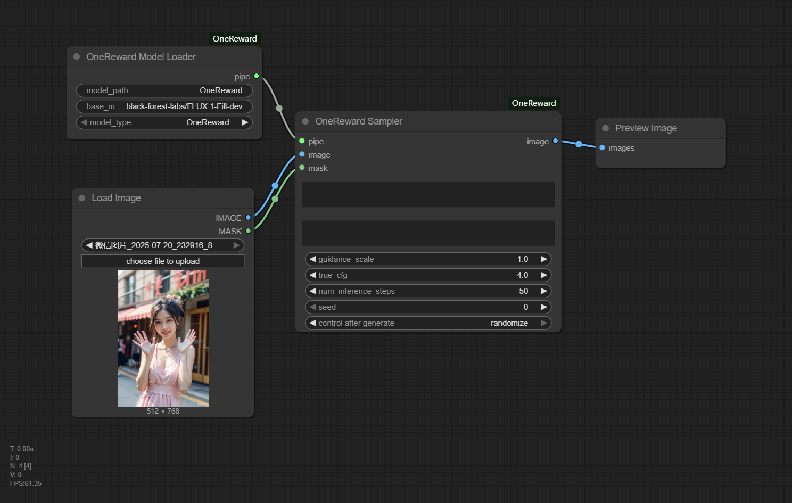

# ComfyUI_OneReward
ByteDance OneReward implementation for ComfyUI - Image inpainting, object removal, and image extension.



## Installation

```bash
cd ComfyUI/custom_nodes
git clone https://github.com/leeguandong/ComfyUI-OneReward
cd ComfyUI-OneReward
pip install -r requirements.txt
```

## Nodes

### OneReward Model Loader
Loads OneReward or OneRewardDynamic model.

**Parameters:**
- `model_type`: OneReward or OneRewardDynamic

### OneReward Sampler
Main sampling node for inpainting.

**Parameters:**
- `pipe`: Model from loader
- `image`: Input image
- `mask`: Mask image
- `prompt`: Text prompt
- `negative_prompt`: Negative prompt (default: "nsfw")
- `guidance_scale`: Guidance scale (default: 1.0)
- `true_cfg`: CFG scale (default: 4.0)
- `num_inference_steps`: Number of steps (default: 50)
- `seed`: Random seed

## Usage Examples

### Image Fill
```
prompt: 'the words "ByteDance", and in the next line "OneReward"'
negative_prompt: "nsfw"
guidance_scale: 1.0
true_cfg: 4.0
steps: 50
```

### Object Removal
```
prompt: "remove"
negative_prompt: "nsfw"
guidance_scale: 1.0
true_cfg: 4.0
steps: 50
```

### Image Extend (with prompt)
```
prompt: "Deep in the forest, surrounded by colorful flowers"
negative_prompt: "nsfw"
guidance_scale: 1.0
true_cfg: 4.0
steps: 50
```

### Image Extend (without prompt)
```
prompt: "high-definition, perfect composition"
negative_prompt: "nsfw"
guidance_scale: 1.0
true_cfg: 4.0
steps: 50
```

## Stars

[](https://star-history.com/#ComfyUI_OneReward&Date)

## Credits

- [ByteDance OneReward](https://github.com/bytedance/OneReward)
- [FLUX.1-Fill-dev](https://huggingface.co/black-forest-labs/FLUX.1-Fill-dev)


